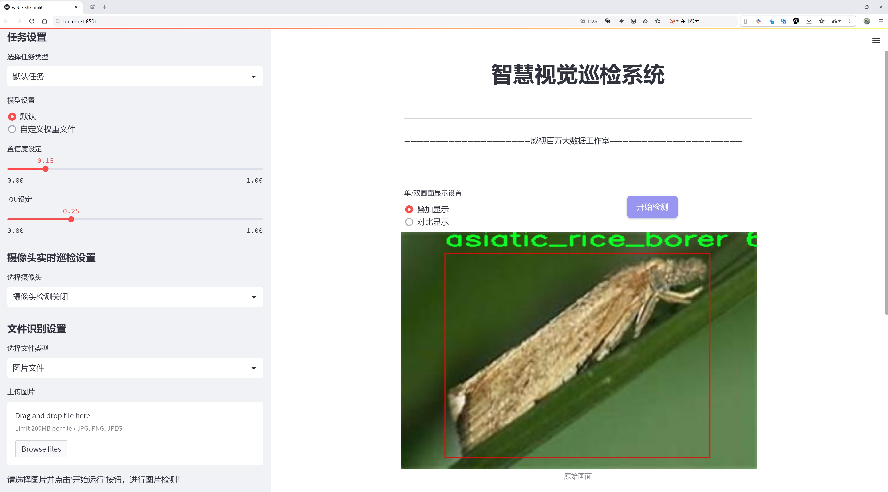
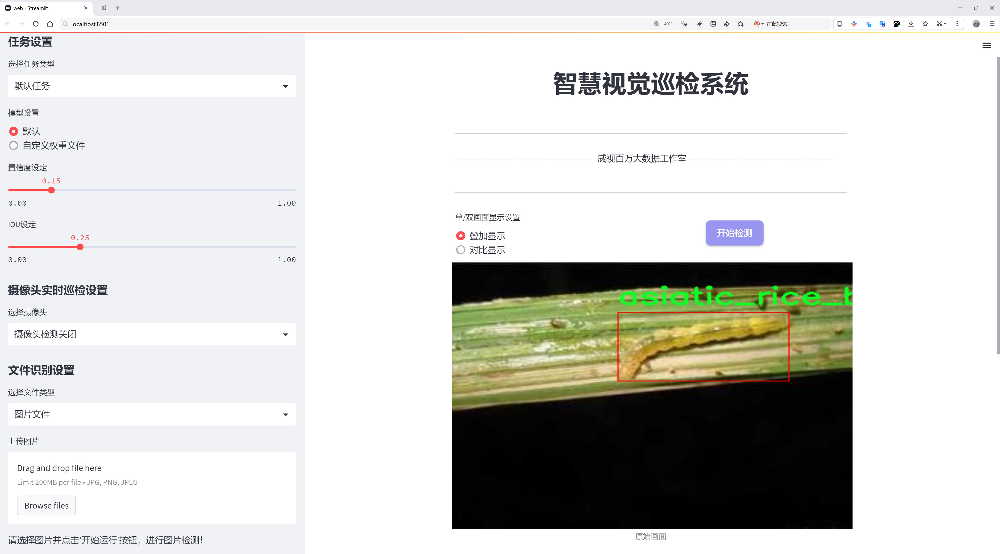
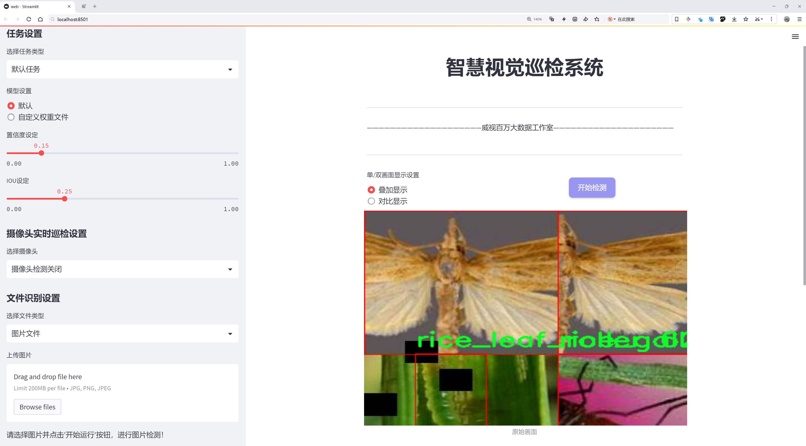
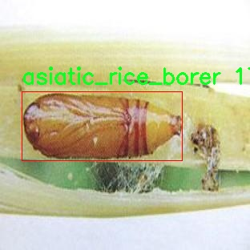
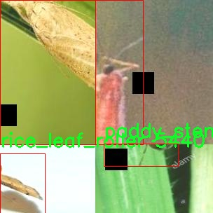
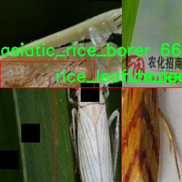
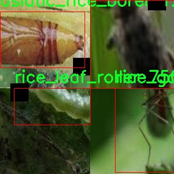
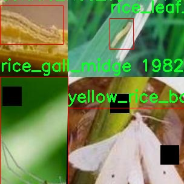

# 水稻害虫检测检测系统源码分享
 # [一条龙教学YOLOV8标注好的数据集一键训练_70+全套改进创新点发刊_Web前端展示]

### 1.研究背景与意义

项目参考[AAAI Association for the Advancement of Artificial Intelligence](https://gitee.com/qunmasj/projects)

研究背景与意义

水稻是全球范围内重要的粮食作物之一，尤其在亚洲地区，其种植面积和产量占据了世界的相当大比例。然而，水稻生产面临着诸多挑战，其中水稻害虫的侵袭是影响水稻产量和品质的主要因素之一。根据统计，水稻害虫的损失可达全球水稻产量的10%至30%。因此，及时、准确地识别和监测水稻害虫，对于保障水稻的高产和可持续发展具有重要的现实意义。

近年来，随着计算机视觉和深度学习技术的迅猛发展，基于图像识别的害虫检测系统逐渐成为研究的热点。YOLO（You Only Look Once）系列模型因其高效的实时检测能力，广泛应用于物体检测领域。YOLOv8作为该系列的最新版本，具有更高的准确性和更快的处理速度，为水稻害虫的自动检测提供了新的可能性。然而，现有的YOLOv8模型在特定领域应用时，仍需进行针对性的改进，以适应不同环境和数据集的特征。

本研究旨在基于改进的YOLOv8模型，构建一个高效的水稻害虫检测系统。我们使用的数据集包含3156张图像，涵盖了10类水稻害虫，包括亚洲水稻螟、褐飞虱、稻茎蛆、稻蓟马、稻叶虫、稻叶跳虫、稻叶卷虫、水稻水象甲、小褐飞虱和黄水稻螟。这些数据不仅为模型的训练提供了丰富的样本，也为后续的模型评估和优化奠定了基础。

通过对YOLOv8模型的改进，我们期望能够提升其在水稻害虫检测中的准确性和鲁棒性。这一改进不仅包括网络结构的优化，还将结合数据增强、迁移学习等技术，以提高模型在复杂环境下的适应能力。此外，研究还将探索不同特征提取方法对检测效果的影响，力求在保证检测速度的同时，最大限度地提高检测精度。

本研究的意义不仅在于推动水稻害虫检测技术的发展，更在于为农业生产提供一种智能化、自动化的解决方案。通过实现高效的害虫监测，农民可以及时采取防治措施，从而减少化学农药的使用，降低环境污染，促进可持续农业的发展。此外，该系统的成功应用还可以为其他农作物的害虫检测提供借鉴，具有广泛的推广价值。

综上所述，基于改进YOLOv8的水稻害虫检测系统的研究，不仅填补了现有技术在特定领域应用中的空白，也为未来农业智能化发展提供了新的思路和方法。通过深入探索水稻害虫的自动检测技术，我们期待能够为全球粮食安全和可持续农业发展贡献一份力量。

### 2.图片演示







##### 注意：由于此博客编辑较早，上面“2.图片演示”和“3.视频演示”展示的系统图片或者视频可能为老版本，新版本在老版本的基础上升级如下：（实际效果以升级的新版本为准）

  （1）适配了YOLOV8的“目标检测”模型和“实例分割”模型，通过加载相应的权重（.pt）文件即可自适应加载模型。

  （2）支持“图片识别”、“视频识别”、“摄像头实时识别”三种识别模式。

  （3）支持“图片识别”、“视频识别”、“摄像头实时识别”三种识别结果保存导出，解决手动导出（容易卡顿出现爆内存）存在的问题，识别完自动保存结果并导出到。

  （4）支持Web前端系统中的标题、背景图等自定义修改，后面提供修改教程。

  另外本项目提供训练的数据集和训练教程,暂不提供权重文件（best.pt）,需要您按照教程进行训练后实现图片演示和Web前端界面演示的效果。

### 3.视频演示

[3.1 视频演示](https://www.bilibili.com/video/BV1RysLesEnu/?vd_source=ff015de2d29cbe2a9cdbfa7064407a08)

### 4.数据集信息展示

数据集信息展示

在现代农业中，水稻作为全球重要的粮食作物，其产量和质量直接影响到粮食安全和农民的生计。然而，水稻害虫的侵扰对水稻的生长构成了严重威胁，因此，开发高效的害虫检测系统显得尤为重要。本数据集“rice-pest-bb”专为改进YOLOv8模型在水稻害虫检测任务中的应用而设计，旨在提升检测的准确性和效率。

该数据集包含3156幅高质量的图像，涵盖了10个不同的水稻害虫类别。这些类别包括：亚洲水稻螟（asiatic_rice_borer）、褐飞虱（brown_plant_hopper）、稻茎虫（paddy_stem_maggot）、稻蓟马（rice_gall_midge）、水稻叶虫（rice_leaf_caterpillar）、水稻叶蝉（rice_leaf_hopper）、水稻叶卷虫（rice_leaf_roller）、水稻水象甲（rice_water_weevil）、小褐飞虱（small_brown_plant_hopper）以及黄水稻螟（yellow_rice_borer）。这些害虫在不同的生长阶段对水稻造成不同程度的损害，因此，能够准确识别和分类这些害虫是实现精准农业的关键。

数据集中的图像经过精心挑选和标注，确保了其在训练深度学习模型时的有效性和可靠性。每一类害虫的图像均具有多样性，涵盖了不同的拍摄角度、光照条件和背景环境。这种多样性不仅增强了模型的泛化能力，还提高了其在实际应用中的适应性。通过使用此数据集，研究人员和开发者可以有效地训练YOLOv8模型，使其能够在实际田间环境中快速、准确地识别水稻害虫。

此外，该数据集采用了CC BY 4.0许可证，允许用户在遵循相关规定的前提下自由使用、修改和分发数据。这种开放性为学术界和工业界的研究人员提供了便利，使他们能够在此基础上进行进一步的研究和开发。通过共享数据集，研究人员可以更好地合作，推动水稻害虫检测技术的进步。

在训练过程中，使用者可以根据具体需求对数据集进行增强处理，例如调整图像的大小、旋转、翻转等，以提高模型的鲁棒性。数据集中的“bb_augmented_320_3x”版本为用户提供了额外的增强选项，使得模型在面对复杂的实际环境时，能够保持高效的检测性能。

总之，数据集“rice-pest-bb”不仅为水稻害虫检测提供了丰富的图像数据，还为改进YOLOv8模型的训练奠定了坚实的基础。通过充分利用这一数据集，研究人员能够更深入地探索水稻害虫的特征与行为，从而为农业生产提供科学依据，助力实现更高效的害虫管理和水稻种植。











### 5.全套项目环境部署视频教程（零基础手把手教学）

[5.1 环境部署教程链接（零基础手把手教学）](https://www.ixigua.com/7404473917358506534?logTag=c807d0cbc21c0ef59de5)


[5.2 安装Python虚拟环境创建和依赖库安装视频教程链接（零基础手把手教学）](https://www.ixigua.com/7404474678003106304?logTag=1f1041108cd1f708b01a)

### 6.手把手YOLOV8训练视频教程（零基础小白有手就能学会）

[6.1 环境部署教程链接（零基础手把手教学）](https://www.ixigua.com/7404477157818401292?logTag=d31a2dfd1983c9668658)

### 7.70+种全套YOLOV8创新点代码加载调参视频教程（一键加载写好的改进模型的配置文件）

[7.1 环境部署教程链接（零基础手把手教学）](https://www.ixigua.com/7404478314661806627?logTag=29066f8288e3f4eea3a4)

### 8.70+种全套YOLOV8创新点原理讲解（非科班也可以轻松写刊发刊，V10版本正在科研待更新）

由于篇幅限制，每个创新点的具体原理讲解就不一一展开，具体见下列网址中的创新点对应子项目的技术原理博客网址【Blog】：


[8.1 70+种全套YOLOV8创新点原理讲解链接](https://gitee.com/qunmasj/good)

### 9.系统功能展示（检测对象为举例，实际内容以本项目数据集为准）

图1.系统支持检测结果表格显示

  图2.系统支持置信度和IOU阈值手动调节

  图3.系统支持自定义加载权重文件best.pt(需要你通过步骤5中训练获得)

  图4.系统支持摄像头实时识别

  图5.系统支持图片识别

  图6.系统支持视频识别

  图7.系统支持识别结果文件自动保存

  图8.系统支持Excel导出检测结果数据


### 10.原始YOLOV8算法原理

原始YOLOv8算法原理

YOLOv8算法是Ultralytics公司在2023年推出的目标检测领域的重大进展，建立在以往YOLO系列的成功基础上，融入了诸多创新和改进，使其在性能和灵活性上都得到了显著提升。YOLOv8的设计理念是快速、准确且易于使用，适用于目标检测、图像分割和图像分类等多种任务。其网络结构主要由输入层、主干网络（Backbone）、特征增强网络（Neck）和输出层（Head）四个部分组成。

在输入层，YOLOv8默认接收640x640像素的图像，但为了适应不同长宽比的图像，算法采用了自适应图片缩放技术。这种技术的核心思想是将图像的长边按比例缩小到指定尺寸，然后对短边进行填充，以减少信息冗余和提高推理速度。此外，YOLOv8在训练过程中引入了Mosaic图像增强技术，该技术通过随机选择四张图像进行缩放和拼接，生成新的训练样本。这种增强方式不仅提高了模型对不同位置和周围像素的学习能力，还有效提升了预测精度。

YOLOv8的主干网络部分采用了C2F模块，取代了YOLOv5中的C3模块。C2F模块通过并行化更多的梯度流分支，确保了轻量化的同时获得了更丰富的梯度信息。这种设计灵感来源于YOLOv7中的ELAN模块，旨在提高模型的精度和延迟表现。C2F模块的引入，使得YOLOv8在特征提取过程中能够更有效地捕捉多尺度信息，进而提升目标检测的准确性。

在特征增强网络（Neck）部分，YOLOv8采用了PAN-FPN（Path Aggregation Network with Feature Pyramid Network）的思想，通过上采样和下采样操作对不同尺度的特征图进行融合。这种设计使得YOLOv8能够更好地处理多尺度目标，提高了对小目标的检测能力。与YOLOv5相比，YOLOv8在Neck部分的结构更为简化，去除了多余的卷积连接层，直接对Backbone不同阶段输出的特征进行上采样，进一步提升了计算效率。

YOLOv8的输出层（Head）是其最显著的创新之一。该部分从传统的耦合头（Coupled-Head）转变为解耦头（Decoupled-Head），将分类和回归任务分为两个独立的分支。这种解耦设计使得每个任务可以更加专注于自身的目标，解决了复杂场景下定位不准和分类错误的问题。在损失函数的设计上，YOLOv8摒弃了Obj分支，采用了BCELoss（Binary Cross Entropy Loss）进行分类损失计算，并在边界框回归分支中使用了DFL（Distribution Focal Loss）和CIoULoss（Complete Intersection over Union Loss），旨在使网络快速聚焦于标签附近的数值，提高预测的准确性。

值得注意的是，YOLOv8引入了Anchor-Free的目标检测方法，摒弃了传统的Anchor-Based思想。传统方法依赖于预设的锚框来预测目标位置，虽然这种方法在一定程度上提高了模型的精准度和召回率，但也增加了计算复杂度，并且在处理不同尺度和形状的目标时缺乏灵活性。YOLOv8通过将目标检测转化为关键点检测，直接预测目标的位置和大小，使得网络能够更快地聚焦于目标区域，从而提升了检测速度和精度。

YOLOv8在训练时间和检测精度上都得到了显著提升，其模型权重文件的轻量化设计使得其能够在各种嵌入式设备上部署，满足实时检测的需求。与之前的YOLO版本相比，YOLOv8不仅在精度上有了显著提高，还在计算效率上表现出色，能够处理更复杂的目标检测任务。

总的来说，YOLOv8通过引入自适应图片缩放、Mosaic增强、C2F模块、PAN-FPN结构、解耦头和Anchor-Free方法等一系列创新，极大地提升了目标检测的性能和灵活性。其设计理念和技术创新使得YOLOv8成为了目标检测领域的一个重要里程碑，为后续的研究和应用提供了强有力的支持。


### 11.项目核心源码讲解（再也不用担心看不懂代码逻辑）

#### 11.1 ui.py

以下是经过简化和注释的核心代码：

```python
import sys
import subprocess
from QtFusion.path import abs_path

def run_script(script_path):
    """
    使用当前 Python 环境运行指定的脚本。

    Args:
        script_path (str): 要运行的脚本路径
    """
    # 获取当前 Python 解释器的路径
    python_path = sys.executable

    # 构建运行命令，使用 streamlit 运行指定的脚本
    command = f'"{python_path}" -m streamlit run "{script_path}"'

    # 执行命令并等待其完成
    result = subprocess.run(command, shell=True)
    
    # 检查命令执行结果，如果返回码不为0，则表示出错
    if result.returncode != 0:
        print("脚本运行出错。")

# 主程序入口
if __name__ == "__main__":
    # 指定要运行的脚本路径
    script_path = abs_path("web.py")

    # 调用函数运行脚本
    run_script(script_path)
```

### 代码注释说明：
1. **导入模块**：
   - `sys`：用于获取当前 Python 解释器的路径。
   - `subprocess`：用于执行外部命令。
   - `abs_path`：从 `QtFusion.path` 导入的函数，用于获取脚本的绝对路径。

2. **`run_script` 函数**：
   - 接受一个参数 `script_path`，表示要运行的 Python 脚本的路径。
   - 使用 `sys.executable` 获取当前 Python 解释器的路径。
   - 构建一个命令字符串，使用 `streamlit` 运行指定的脚本。
   - 使用 `subprocess.run` 执行命令，并等待其完成。
   - 检查命令的返回码，如果不为0，表示脚本运行出错，打印错误信息。

3. **主程序入口**：
   - 当脚本作为主程序运行时，指定要运行的脚本路径（`web.py`）。
   - 调用 `run_script` 函数来执行该脚本。

这个程序文件 `ui.py` 的主要功能是通过当前的 Python 环境来运行一个指定的脚本，具体来说是一个名为 `web.py` 的脚本。文件中首先导入了一些必要的模块，包括 `sys`、`os` 和 `subprocess`，这些模块提供了与系统交互和执行外部命令的功能。此外，还导入了 `QtFusion.path` 模块中的 `abs_path` 函数，用于获取文件的绝对路径。

在 `run_script` 函数中，首先获取当前 Python 解释器的路径，这通过 `sys.executable` 实现。接着，构建一个命令字符串，这个命令使用 `streamlit` 来运行指定的脚本。具体来说，命令的格式是将 Python 解释器的路径和要运行的脚本路径组合在一起，形成一个完整的命令。

然后，使用 `subprocess.run` 方法来执行这个命令。该方法会在一个新的进程中运行命令，并等待其完成。命令执行后，会检查返回码，如果返回码不为 0，表示脚本运行过程中出现了错误，此时会打印出“脚本运行出错”的提示信息。

在文件的最后部分，使用 `if __name__ == "__main__":` 语句来确保当这个文件作为主程序运行时，才会执行下面的代码。在这里，首先调用 `abs_path` 函数来获取 `web.py` 的绝对路径，然后调用 `run_script` 函数来运行这个脚本。

总的来说，这个文件的主要目的是提供一个简单的接口来运行一个特定的 Python 脚本，并处理可能出现的错误。

#### 11.2 ultralytics\models\sam\amg.py

以下是代码中最核心的部分，并附上详细的中文注释：

```python
import torch

def is_box_near_crop_edge(
    boxes: torch.Tensor, crop_box: List[int], orig_box: List[int], atol: float = 20.0
) -> torch.Tensor:
    """
    判断给定的边界框是否接近裁剪边缘。

    参数：
    boxes: 要检查的边界框，格式为 (x1, y1, x2, y2) 的张量。
    crop_box: 当前裁剪框的边界，格式为 [x0, y0, x1, y1]。
    orig_box: 原始图像的边界框，格式为 [x0, y0, x1, y1]。
    atol: 允许的绝对误差，默认为 20.0。

    返回：
    返回一个布尔张量，指示每个边界框是否接近裁剪边缘。
    """
    # 将裁剪框和原始框转换为张量
    crop_box_torch = torch.as_tensor(crop_box, dtype=torch.float, device=boxes.device)
    orig_box_torch = torch.as_tensor(orig_box, dtype=torch.float, device=boxes.device)
    
    # 将边界框从裁剪坐标转换回原始坐标
    boxes = uncrop_boxes_xyxy(boxes, crop_box).float()
    
    # 检查边界框是否接近裁剪框的边缘
    near_crop_edge = torch.isclose(boxes, crop_box_torch[None, :], atol=atol, rtol=0)
    # 检查边界框是否接近原始图像的边缘
    near_image_edge = torch.isclose(boxes, orig_box_torch[None, :], atol=atol, rtol=0)
    
    # 只有当边界框接近裁剪边缘且不接近原始图像边缘时，才返回 True
    near_crop_edge = torch.logical_and(near_crop_edge, ~near_image_edge)
    
    # 如果有任何边界框接近裁剪边缘，则返回 True
    return torch.any(near_crop_edge, dim=1)


def uncrop_boxes_xyxy(boxes: torch.Tensor, crop_box: List[int]) -> torch.Tensor:
    """
    将裁剪的边界框转换回原始图像坐标。

    参数：
    boxes: 裁剪后的边界框，格式为 (x1, y1, x2, y2) 的张量。
    crop_box: 当前裁剪框的边界，格式为 [x0, y0, x1, y1]。

    返回：
    返回转换后的边界框，格式为 (x1, y1, x2, y2) 的张量。
    """
    x0, y0, _, _ = crop_box  # 获取裁剪框的左上角坐标
    offset = torch.tensor([[x0, y0, x0, y0]], device=boxes.device)  # 创建偏移量张量
    
    # 检查 boxes 是否有通道维度
    if len(boxes.shape) == 3:
        offset = offset.unsqueeze(1)  # 如果有通道维度，则扩展偏移量的维度
    
    # 将偏移量加到 boxes 上，返回未裁剪的边界框
    return boxes + offset


def batched_mask_to_box(masks: torch.Tensor) -> torch.Tensor:
    """
    计算给定掩码的边界框，返回格式为 (x1, y1, x2, y2)。

    参数：
    masks: 输入掩码，形状为 C1xC2x...xHxW。

    返回：
    返回形状为 C1xC2x...x4 的边界框张量。
    """
    # 如果掩码为空，则返回 [0, 0, 0, 0]
    if torch.numel(masks) == 0:
        return torch.zeros(*masks.shape[:-2], 4, device=masks.device)

    # 规范化形状为 CxHxW
    shape = masks.shape
    h, w = shape[-2:]
    masks = masks.flatten(0, -3) if len(shape) > 2 else masks.unsqueeze(0)
    
    # 获取掩码的上下边缘
    in_height, _ = torch.max(masks, dim=-1)
    in_height_coords = in_height * torch.arange(h, device=in_height.device)[None, :]
    bottom_edges, _ = torch.max(in_height_coords, dim=-1)
    in_height_coords = in_height_coords + h * (~in_height)
    top_edges, _ = torch.min(in_height_coords, dim=-1)

    # 获取掩码的左右边缘
    in_width, _ = torch.max(masks, dim=-2)
    in_width_coords = in_width * torch.arange(w, device=in_width.device)[None, :]
    right_edges, _ = torch.max(in_width_coords, dim=-1)
    in_width_coords = in_width_coords + w * (~in_width)
    left_edges, _ = torch.min(in_width_coords, dim=-1)

    # 如果掩码为空，则将边界框替换为 [0, 0, 0, 0]
    empty_filter = (right_edges < left_edges) | (bottom_edges < top_edges)
    out = torch.stack([left_edges, top_edges, right_edges, bottom_edges], dim=-1)
    out = out * (~empty_filter).unsqueeze(-1)

    # 返回到原始形状
    return out.reshape(*shape[:-2], 4) if len(shape) > 2 else out[0]
```

### 代码核心部分说明：
1. **is_box_near_crop_edge**: 判断边界框是否接近裁剪框的边缘，并确保不接近原始图像的边缘。
2. **uncrop_boxes_xyxy**: 将裁剪后的边界框转换回原始图像坐标。
3. **batched_mask_to_box**: 从掩码中计算边界框，返回格式为 (x1, y1, x2, y2)。 

这些函数是处理图像裁剪和边界框生成的核心逻辑，适用于目标检测等计算机视觉任务。

这个程序文件主要实现了一些与图像处理和深度学习相关的功能，特别是在目标检测和分割任务中使用的功能。文件中包含多个函数，每个函数都有其特定的用途，以下是对这些函数的逐一说明。

首先，`is_box_near_crop_edge`函数用于判断给定的边界框是否接近裁剪边缘。它接收三个参数：`boxes`（待检测的边界框）、`crop_box`（裁剪区域的边界框）和`orig_box`（原始图像的边界框）。函数通过计算边界框与裁剪边缘的距离，并返回一个布尔张量，指示哪些边界框接近裁剪边缘。

接下来的`batch_iterator`函数用于从输入参数中生成批次数据。它确保所有输入参数的长度相同，并根据指定的批次大小返回数据的批次。

`calculate_stability_score`函数计算一组掩膜的稳定性得分。稳定性得分是通过对掩膜进行阈值处理后计算的交并比（IoU），用于评估掩膜的质量。

`build_point_grid`函数生成一个二维网格，网格中的点均匀分布在[0,1]x[0,1]的范围内。`build_all_layer_point_grids`函数则为不同层次生成多个点网格，适用于多尺度的图像处理。

`generate_crop_boxes`函数生成不同大小的裁剪框，适用于图像的多层次处理。它根据图像的尺寸、层数和重叠比例生成裁剪框的列表。

`uncrop_boxes_xyxy`、`uncrop_points`和`uncrop_masks`函数用于将裁剪后的边界框、点和掩膜还原到原始图像的坐标系中。它们通过添加裁剪框的偏移量来实现这一点。

`remove_small_regions`函数用于去除掩膜中小的、不连通的区域或孔洞。它使用OpenCV库中的连通组件分析来实现这一功能，并返回处理后的掩膜和一个指示是否进行了修改的布尔值。

`batched_mask_to_box`函数用于计算掩膜周围的边界框，返回格式为XYXY。该函数处理多维输入，并确保即使在掩膜为空的情况下也能返回有效的边界框。

总体而言，这个文件提供了一系列用于图像处理和目标检测的工具函数，涵盖了从裁剪、还原到掩膜处理等多个方面，为后续的深度学习模型训练和推理提供了支持。

#### 11.3 ultralytics\engine\predictor.py

以下是代码中最核心的部分，并附上详细的中文注释：

```python
class BasePredictor:
    """
    BasePredictor类用于创建预测器的基类。

    属性:
        args (SimpleNamespace): 预测器的配置。
        save_dir (Path): 保存结果的目录。
        done_warmup (bool): 预测器是否完成初始化。
        model (nn.Module): 用于预测的模型。
        data (dict): 数据配置。
        device (torch.device): 用于预测的设备。
        dataset (Dataset): 用于预测的数据集。
    """

    def __init__(self, cfg=DEFAULT_CFG, overrides=None, _callbacks=None):
        """
        初始化BasePredictor类。

        参数:
            cfg (str, optional): 配置文件的路径，默认为DEFAULT_CFG。
            overrides (dict, optional): 配置覆盖，默认为None。
        """
        self.args = get_cfg(cfg, overrides)  # 获取配置
        self.save_dir = get_save_dir(self.args)  # 获取保存目录
        if self.args.conf is None:
            self.args.conf = 0.25  # 默认置信度阈值为0.25
        self.done_warmup = False  # 初始化状态
        self.model = None  # 模型初始化为None
        self.data = self.args.data  # 数据配置
        self.device = None  # 设备初始化为None
        self.dataset = None  # 数据集初始化为None
        self.callbacks = _callbacks or callbacks.get_default_callbacks()  # 获取回调函数

    def preprocess(self, im):
        """
        在推理之前准备输入图像。

        参数:
            im (torch.Tensor | List(np.ndarray)): 输入图像，可以是张量或图像列表。
        
        返回:
            torch.Tensor: 处理后的图像张量。
        """
        not_tensor = not isinstance(im, torch.Tensor)  # 检查输入是否为张量
        if not_tensor:
            im = np.stack(self.pre_transform(im))  # 预处理图像
            im = im[..., ::-1].transpose((0, 3, 1, 2))  # BGR转RGB，并调整维度
            im = np.ascontiguousarray(im)  # 确保数组是连续的
            im = torch.from_numpy(im)  # 转换为张量

        im = im.to(self.device)  # 将图像移动到指定设备
        im = im.half() if self.model.fp16 else im.float()  # 转换数据类型
        if not_tensor:
            im /= 255  # 将像素值归一化到0.0 - 1.0
        return im

    def inference(self, im, *args, **kwargs):
        """对给定图像进行推理。"""
        return self.model(im, *args, **kwargs)  # 使用模型进行推理

    def stream_inference(self, source=None, model=None, *args, **kwargs):
        """对摄像头输入进行实时推理并保存结果。"""
        if not self.model:
            self.setup_model(model)  # 设置模型

        self.setup_source(source if source is not None else self.args.source)  # 设置数据源

        for batch in self.dataset:  # 遍历数据集
            im = self.preprocess(batch[1])  # 预处理图像
            preds = self.inference(im, *args, **kwargs)  # 进行推理
            self.results = self.postprocess(preds, im, batch[1])  # 后处理结果

            # 可视化、保存、写入结果
            for i in range(len(batch[1])):
                self.write_results(i, self.results, batch)  # 写入结果

    def setup_model(self, model, verbose=True):
        """初始化YOLO模型并设置为评估模式。"""
        self.model = AutoBackend(
            model or self.args.model,
            device=select_device(self.args.device, verbose=verbose),
            fp16=self.args.half,
            fuse=True,
            verbose=verbose,
        )
        self.device = self.model.device  # 更新设备
        self.model.eval()  # 设置模型为评估模式

    def write_results(self, idx, results, batch):
        """将推理结果写入文件或目录。"""
        # 处理结果并保存
        # 这里可以添加具体的保存逻辑
```

### 代码核心部分说明
1. **BasePredictor类**：这是一个用于预测的基类，包含了初始化、预处理、推理、流式推理、模型设置和结果写入等方法。
2. **__init__方法**：初始化预测器的配置和状态。
3. **preprocess方法**：对输入图像进行预处理，包括格式转换和归一化。
4. **inference方法**：调用模型进行推理。
5. **stream_inference方法**：处理实时视频流的推理逻辑。
6. **setup_model方法**：初始化YOLO模型并设置为评估模式。
7. **write_results方法**：将推理结果保存到指定位置。

这些方法和类构成了YOLO模型进行推理的核心逻辑。

这个程序文件是一个用于进行目标检测的预测器，主要是基于Ultralytics YOLO（You Only Look Once）模型。该文件提供了在多种来源（如图像、视频、网络摄像头等）上进行预测的功能，并且支持多种模型格式。

在文件的开头，程序提供了使用说明，包括如何指定不同的输入源和模型格式。支持的输入源包括本地文件、网络流、YouTube视频等，而支持的模型格式则包括PyTorch、ONNX、TensorRT等多种格式。

程序的核心是`BasePredictor`类，该类负责初始化预测器的配置、模型、数据等。初始化时，会读取配置文件，设置保存结果的目录，并进行一些基本的参数设置，如置信度阈值等。类中还定义了一些属性，用于存储模型、数据集、视频路径、写入器等信息。

`BasePredictor`类的主要方法包括：
- `preprocess`：对输入图像进行预处理，将其转换为适合模型输入的格式。
- `inference`：执行模型推理，得到预测结果。
- `write_results`：将推理结果写入文件或目录，包括保存检测框、分割掩码等。
- `postprocess`：对预测结果进行后处理，通常用于格式转换或结果筛选。
- `__call__`：使得类的实例可以像函数一样被调用，执行推理。
- `stream_inference`：在实时流中进行推理，适用于视频流或摄像头输入。

此外，程序还实现了对模型的设置、源的配置、结果的可视化和保存等功能。通过`setup_model`方法，可以初始化YOLO模型并设置为评估模式。`show`方法用于在窗口中显示图像，而`save_preds`方法则用于将预测结果保存为视频文件。

在推理过程中，程序使用了多线程锁以确保线程安全，避免在多线程环境下出现数据竞争的问题。程序还支持回调机制，可以在特定事件发生时执行用户定义的函数，增强了程序的灵活性和可扩展性。

总体来说，这个文件是一个功能强大的目标检测预测器，能够处理多种输入源和模型格式，适用于实时和离线的目标检测任务。

#### 11.4 train.py

以下是经过简化和注释的核心代码部分：

```python
import os
import torch
import yaml
from ultralytics import YOLO  # 导入YOLO模型

# 设置设备为GPU（如果可用），否则使用CPU
device = "0" if torch.cuda.is_available() else "cpu"

if __name__ == '__main__':  # 确保该模块被直接运行时才执行以下代码
    workers = 1  # 设置数据加载的工作进程数量
    batch = 2    # 设置每个批次的大小

    data_name = "data"  # 数据集名称
    # 获取数据集配置文件的绝对路径
    data_path = abs_path(f'datasets/{data_name}/{data_name}.yaml', path_type='current')  
    unix_style_path = data_path.replace(os.sep, '/')  # 将路径转换为Unix风格

    # 获取数据集目录路径
    directory_path = os.path.dirname(unix_style_path)
    
    # 读取YAML配置文件
    with open(data_path, 'r') as file:
        data = yaml.load(file, Loader=yaml.FullLoader)
    
    # 如果YAML文件中包含'path'项，则修改为当前目录路径
    if 'path' in data:
        data['path'] = directory_path
        # 将修改后的数据写回YAML文件
        with open(data_path, 'w') as file:
            yaml.safe_dump(data, file, sort_keys=False)

    # 加载YOLOv8模型配置
    model = YOLO(model='./ultralytics/cfg/models/v8/yolov8s.yaml', task='detect')  
    
    # 开始训练模型
    results2 = model.train(
        data=data_path,  # 指定训练数据的配置文件路径
        device=device,  # 使用指定的设备进行训练
        workers=workers,  # 使用的工作进程数量
        imgsz=640,  # 输入图像的大小
        epochs=100,  # 训练的轮数
        batch=batch,  # 每个批次的大小
        name='train_v8_' + data_name  # 训练任务的名称
    )
```

### 代码注释说明：
1. **导入库**：导入必要的库，包括`os`（用于文件路径操作）、`torch`（用于深度学习）、`yaml`（用于处理YAML文件）和`YOLO`（用于目标检测模型）。
2. **设备选择**：根据是否有可用的GPU来选择计算设备。
3. **主程序入口**：确保代码在直接运行时执行。
4. **数据集配置**：设置数据集名称并获取相应的YAML配置文件路径。
5. **路径处理**：将路径转换为Unix风格以确保兼容性。
6. **读取和修改YAML文件**：读取数据集配置文件，修改其中的`path`项为当前目录路径，并将修改后的内容写回文件。
7. **模型加载**：加载YOLOv8模型的配置文件。
8. **模型训练**：调用模型的训练方法，指定训练所需的参数，包括数据路径、设备、工作进程数量、图像大小、训练轮数和批次大小。

这个程序文件 `train.py` 是一个用于训练 YOLOv8 模型的脚本。首先，它导入了必要的库，包括 `os`、`torch`、`yaml` 和 `ultralytics` 中的 YOLO 模型。接着，它检查是否有可用的 GPU，如果有则将设备设置为 "0"（即使用第一个 GPU），否则使用 CPU。

在 `if __name__ == '__main__':` 这一块代码中，首先定义了一些训练参数，包括工作进程数 `workers` 和批次大小 `batch`。接下来，指定了数据集的名称 `data_name`，并构建了数据集 YAML 文件的绝对路径。使用 `abs_path` 函数获取路径后，将路径中的分隔符替换为 Unix 风格的分隔符。

然后，程序获取了数据集目录的路径，并打开指定的 YAML 文件以读取数据。通过 `yaml.load` 函数读取 YAML 文件内容，并在保持原有顺序的情况下进行处理。如果 YAML 文件中包含 `path` 项，则将其修改为数据集目录的路径，并将更新后的数据写回 YAML 文件中。

接下来，程序加载了预训练的 YOLOv8 模型，指定了模型的配置文件。之后，调用 `model.train` 方法开始训练模型。在训练过程中，指定了训练数据的配置文件路径、设备、工作进程数、输入图像的大小（640x640）、训练的 epoch 数（100）以及训练任务的名称。

总的来说，这个脚本的主要功能是配置和启动 YOLOv8 模型的训练过程，确保数据集路径正确，并设置相关的训练参数。

#### 11.5 ultralytics\models\__init__.py

以下是代码中最核心的部分，并附上详细的中文注释：

```python
# 导入所需的模块
from .rtdetr import RTDETR  # 从当前包中导入 RTDETR 类
from .sam import SAM        # 从当前包中导入 SAM 类
from .yolo import YOLO      # 从当前包中导入 YOLO 类

# 定义可导出的模块，允许在其他模块中简单导入
__all__ = "YOLO", "RTDETR", "SAM"  # 指定可以被外部导入的类名
```

### 注释说明：
1. **导入模块**：
   - `from .rtdetr import RTDETR`：从当前包（即包含此代码的目录）中导入 `RTDETR` 类。
   - `from .sam import SAM`：从当前包中导入 `SAM` 类。
   - `from .yolo import YOLO`：从当前包中导入 `YOLO` 类。

2. **可导出模块**：
   - `__all__` 是一个特殊变量，用于定义当使用 `from module import *` 时，哪些名称是可以被导出的。在这里，指定了 `YOLO`、`RTDETR` 和 `SAM` 这三个类可以被外部模块导入。这样做可以控制模块的接口，避免不必要的名称被导出。

这个程序文件是Ultralytics YOLO项目中的一个初始化文件，通常用于模块的组织和导入。文件的开头有一个注释，指出这是Ultralytics YOLO的代码，并提到该项目遵循AGPL-3.0许可证。

接下来，文件通过相对导入的方式引入了三个类或模块：RTDETR、SAM和YOLO。这些类或模块可能是实现不同功能的核心组件，例如YOLO是一个流行的目标检测算法，而RTDETR和SAM可能是与之相关的其他模型或算法。

最后，`__all__`变量被定义为一个元组，包含了三个字符串，分别是"YOLO"、"RTDETR"和"SAM"。这个变量的作用是控制从该模块中使用`from module import *`语句时，哪些名称会被导入。通过定义`__all__`，可以使得模块的使用更加简洁，避免不必要的名称暴露。

总的来说，这个文件的主要功能是组织和简化模块的导入，使得用户在使用Ultralytics YOLO时能够方便地访问这些核心组件。

#### 11.6 ultralytics\models\sam\modules\tiny_encoder.py

以下是经过简化并添加详细中文注释的核心代码部分：

```python
import torch
import torch.nn as nn
import torch.nn.functional as F

class Conv2d_BN(torch.nn.Sequential):
    """执行2D卷积并随后进行批量归一化的顺序容器。"""

    def __init__(self, in_channels, out_channels, kernel_size=1, stride=1, padding=0):
        """初始化卷积层和批量归一化层。"""
        super().__init__()
        # 添加卷积层
        self.add_module("conv", torch.nn.Conv2d(in_channels, out_channels, kernel_size, stride, padding, bias=False))
        # 添加批量归一化层
        self.add_module("bn", torch.nn.BatchNorm2d(out_channels))

class PatchEmbed(nn.Module):
    """将图像嵌入为补丁并投影到指定的嵌入维度。"""

    def __init__(self, in_chans, embed_dim, resolution, activation):
        """初始化补丁嵌入层。"""
        super().__init__()
        self.patches_resolution = (resolution // 4, resolution // 4)  # 计算补丁的分辨率
        self.seq = nn.Sequential(
            Conv2d_BN(in_chans, embed_dim // 2, kernel_size=3, stride=2, padding=1),
            activation(),
            Conv2d_BN(embed_dim // 2, embed_dim, kernel_size=3, stride=2, padding=1),
        )

    def forward(self, x):
        """将输入张量通过补丁嵌入层的序列操作。"""
        return self.seq(x)

class MBConv(nn.Module):
    """移动反向瓶颈卷积层，属于EfficientNet架构的一部分。"""

    def __init__(self, in_chans, out_chans, expand_ratio, activation):
        """初始化MBConv层。"""
        super().__init__()
        self.conv1 = Conv2d_BN(in_chans, in_chans * expand_ratio, kernel_size=1)
        self.act1 = activation()
        self.conv2 = Conv2d_BN(in_chans * expand_ratio, in_chans * expand_ratio, kernel_size=3, padding=1, groups=in_chans * expand_ratio)
        self.act2 = activation()
        self.conv3 = Conv2d_BN(in_chans * expand_ratio, out_chans, kernel_size=1, bn_weight_init=0.0)
        self.act3 = activation()

    def forward(self, x):
        """实现MBConv层的前向传播。"""
        shortcut = x  # 残差连接
        x = self.conv1(x)
        x = self.act1(x)
        x = self.conv2(x)
        x = self.act2(x)
        x = self.conv3(x)
        x += shortcut  # 添加残差
        return self.act3(x)

class TinyViT(nn.Module):
    """TinyViT架构，用于视觉任务。"""

    def __init__(self, img_size=224, in_chans=3, num_classes=1000, embed_dims=[96, 192, 384, 768], depths=[2, 2, 6, 2]):
        """初始化TinyViT模型。"""
        super().__init__()
        self.patch_embed = PatchEmbed(in_chans=in_chans, embed_dim=embed_dims[0], resolution=img_size, activation=nn.GELU)
        self.layers = nn.ModuleList()

        # 构建层
        for i_layer in range(len(depths)):
            layer = nn.ModuleList([MBConv(embed_dims[i_layer], embed_dims[i_layer], expand_ratio=4.0, activation=nn.GELU) for _ in range(depths[i_layer])])
            self.layers.append(layer)

        # 分类头
        self.head = nn.Linear(embed_dims[-1], num_classes)

    def forward(self, x):
        """执行输入张量的前向传播。"""
        x = self.patch_embed(x)  # 通过补丁嵌入层
        for layer in self.layers:
            for block in layer:
                x = block(x)  # 通过每个MBConv块
        return self.head(x)  # 通过分类头
```

### 代码注释说明
1. **Conv2d_BN**: 这个类组合了卷积层和批量归一化层，通常用于图像处理中的特征提取。
2. **PatchEmbed**: 该类将输入图像分割成补丁，并将这些补丁投影到一个更高的维度，通常用于Transformer架构中的输入准备。
3. **MBConv**: 这是一个移动反向瓶颈卷积层，设计用于高效的特征提取，特别是在深度学习模型中。
4. **TinyViT**: 这是一个完整的TinyViT模型类，包含补丁嵌入层和多个MBConv层，最后通过一个线性层进行分类。

以上代码是TinyViT模型的核心部分，主要实现了图像的嵌入、特征提取和分类功能。

这个程序文件实现了一个名为TinyViT的视觉模型架构，主要用于图像处理任务。TinyViT是基于视觉变换器（Vision Transformer）设计的，结合了卷积神经网络（CNN）的优点，特别是在图像特征提取方面。代码中包含多个类，每个类负责模型的不同部分，以下是对主要部分的详细说明。

首先，文件导入了一些必要的库，包括PyTorch的核心模块和一些功能模块。接着，定义了多个类来构建TinyViT模型的各个组件。

`Conv2d_BN`类是一个简单的卷积层，后接批量归一化（Batch Normalization），用于提高训练的稳定性和加速收敛。它的构造函数接受多个参数，如输入和输出通道数、卷积核大小、步幅等。

`PatchEmbed`类负责将输入图像分割成小块（patches），并将这些小块投影到指定的嵌入维度。它通过两个卷积层来实现这一过程，输入图像的分辨率会被缩小到原来的1/4。

`MBConv`类实现了移动反向瓶颈卷积（Mobile Inverted Bottleneck Convolution），这是EfficientNet架构中的一部分。该类使用多个卷积层和激活函数来提取特征，并在训练时应用随机深度（Drop Path）以提高模型的泛化能力。

`PatchMerging`类用于合并相邻的特征块，并将其投影到新的维度。它通过一系列卷积操作来实现这一点，帮助模型在特征图中聚合信息。

`ConvLayer`类是一个卷积层，包含多个MBConv层，并支持下采样操作。它可以选择性地使用梯度检查点（Gradient Checkpointing）来节省内存。

`Mlp`类实现了多层感知机（MLP），用于处理输入特征。它包含层归一化和两个全连接层，激活函数为GELU。

`Attention`类实现了多头自注意力机制，支持空间感知。它根据输入的空间分辨率应用注意力偏置，并使用层归一化来处理输入。

`TinyViTBlock`类是TinyViT的基本构建块，结合了自注意力机制和局部卷积。它通过注意力机制处理输入特征，并使用局部卷积来进一步提取信息。

`BasicLayer`类表示TinyViT中的一个基本层，包含多个TinyViT块，并可选择性地进行下采样。

`LayerNorm2d`类实现了2D层归一化，适用于图像数据的归一化处理。

最后，`TinyViT`类是整个模型的核心，负责初始化和构建模型的各个层。它接收输入图像的大小、通道数、类别数等参数，并构建相应的嵌入层、多个基本层和分类头。模型的前向传播通过`forward`方法实现，输入图像经过各层处理后输出最终的分类结果。

总体而言，这个文件实现了一个高效的视觉模型TinyViT，结合了卷积和变换器的优点，适用于各种视觉任务。

### 12.系统整体结构（节选）

### 整体功能和构架概括

该项目是一个基于Ultralytics YOLO模型的目标检测和图像处理框架。其主要功能包括模型训练、推理、图像处理和可视化等。项目的结构模块化，便于扩展和维护。主要模块包括：

- **模型模块**：实现不同的模型架构（如YOLO、TinyViT等），用于目标检测和图像分割。
- **训练模块**：提供训练模型的功能，支持多种数据集和训练参数配置。
- **预测模块**：实现模型推理，支持实时视频流和静态图像的处理。
- **用户界面模块**：提供图形用户界面（GUI），方便用户进行数据探索和可视化。
- **工具模块**：实现一些辅助功能，如数据处理、文件管理等。

### 文件功能整理表

| 文件路径                                       | 功能描述                                                                                   |
|-----------------------------------------------|------------------------------------------------------------------------------------------|
| `ui.py`                                       | 提供一个接口来运行指定的脚本（如`web.py`），用于图形用户界面的启动和管理。               |
| `ultralytics/models/sam/amg.py`              | 实现图像处理和深度学习相关的功能，包括边界框处理、掩膜处理和图像裁剪等。                 |
| `ultralytics/engine/predictor.py`            | 负责目标检测的推理，支持多种输入源和模型格式，提供实时和离线的推理功能。                 |
| `train.py`                                    | 配置和启动YOLOv8模型的训练过程，处理数据集路径和训练参数设置。                          |
| `ultralytics/models/__init__.py`             | 模块初始化文件，组织和简化模型组件的导入，提供YOLO、RTDETR和SAM的访问。                 |
| `ultralytics/models/sam/modules/tiny_encoder.py` | 实现TinyViT模型架构，结合卷积和变换器的优点，用于图像特征提取和处理。                  |
| `ultralytics/data/explorer/gui/dash.py`     | 提供数据探索和可视化的图形用户界面，帮助用户分析和理解数据集。                          |
| `chinese_name_list.py`                        | 可能包含中文名称列表或相关功能，具体功能需要根据文件内容进一步分析。                     |
| `ultralytics/trackers/track.py`              | 实现目标跟踪功能，支持在视频流中进行目标的持续跟踪。                                     |
| `ultralytics/trackers/__init__.py`           | 模块初始化文件，组织和简化目标跟踪相关组件的导入，提供跟踪功能的访问。                   |

以上表格总结了每个文件的主要功能，便于理解整个项目的结构和功能模块。

注意：由于此博客编辑较早，上面“11.项目核心源码讲解（再也不用担心看不懂代码逻辑）”中部分代码可能会优化升级，仅供参考学习，完整“训练源码”、“Web前端界面”和“70+种创新点源码”以“13.完整训练+Web前端界面+70+种创新点源码、数据集获取”的内容为准。

### 13.完整训练+Web前端界面+70+种创新点源码、数据集获取


#完整训练+Web前端界面+70+种创新点源码、数据集获取链接

https://mbd.pub/o/bread/ZpqVlp5r